# Documento de Análise e Projeto de Software
## Rede de Adoção de Animais

**Versão:** 1.0  
**Base:** especificação funcional e arquitetural fornecida pelo usuário  
**Plataforma proposta:** React Native com Expo Router  
**Persistência local:** SQLite  
**Backend:** Supabase (Auth, PostgreSQL, Storage)  
**Estratégia principal:** Offline-first  

---

# 1. Visão do sistema

O sistema é um aplicativo para divulgação de animais disponíveis para adoção. Ele aproxima pessoas interessadas em adotar de protetores independentes, ONGs, abrigos e tutores responsáveis por animais que precisam de um novo lar.

O aplicativo **não realiza matching automático** entre animais e interessados. A descoberta acontece por meio de pesquisa, filtros, lista e mapa interativo.

A consulta de animais disponíveis é pública. Recursos que alteram dados ou representam ações pessoais — como publicar, editar, favoritar ou demonstrar interesse — exigem autenticação.

O aplicativo foi concebido como **offline-first**: dados previamente carregados permanecem disponíveis localmente, alterações podem ser iniciadas sem internet e uma fila local registra operações pendentes para sincronização posterior.

## 1.1 Atores

- **Visitante** — pessoa não autenticada que consulta animais.
- **Usuário autenticado** — usuário com conta ativa.
- **Interessado em adoção** — especialização de usuário autenticado que favorita anúncios ou demonstra interesse.
- **Responsável pelo anúncio** — especialização de usuário autenticado; inclui protetor independente, ONG, abrigo ou tutor.
- **Administrador** — usuário autenticado com permissão de moderação.
- **Supabase** — sistema externo responsável por autenticação, banco remoto e armazenamento de imagens.
- **Dispositivo móvel** — fornece SQLite, câmera, galeria, geolocalização e conectividade.

> Um mesmo usuário pode atuar como interessado e também como responsável por anúncios.

---

# 2. Levantamento de requisitos

## 2.1 Requisitos funcionais

| ID | Descrição | Prioridade | Ator/Origem |
|---|---|---:|---|
| RF01 | O sistema deve permitir consultar publicamente os animais disponíveis para adoção. | Alta | Visitante |
| RF02 | O sistema deve apresentar animais disponíveis e anúncios recentes na tela inicial. | Média | Visitante |
| RF03 | O sistema deve permitir pesquisar anúncios por nome ou localização. | Alta | Visitante |
| RF04 | O sistema deve permitir filtrar anúncios por espécie, porte, idade aproximada, sexo e distância. | Alta | Visitante |
| RF05 | O sistema deve permitir alternar os resultados entre visualização em lista e mapa. | Alta | Visitante |
| RF06 | O sistema deve permitir visualizar detalhes do animal, incluindo fotos, características, cuidados especiais, localização aproximada, situação da adoção e contato. | Alta | Visitante |
| RF07 | O sistema deve permitir cadastro, login e manutenção da sessão do usuário. | Alta | Usuário |
| RF08 | O sistema deve permitir que usuários autenticados criem anúncios de adoção. | Alta | Responsável |
| RF09 | O sistema deve permitir adicionar uma ou mais fotos a um anúncio usando câmera ou galeria. | Alta | Responsável |
| RF10 | O sistema deve permitir que o responsável edite apenas os próprios anúncios. | Alta | Responsável |
| RF11 | O sistema deve permitir que o responsável exclua apenas os próprios anúncios. | Média | Responsável |
| RF12 | O sistema deve permitir que somente o responsável marque o animal como adotado. | Alta | Responsável |
| RF13 | O sistema deve permitir ao responsável visualizar e gerenciar os próprios anúncios. | Alta | Responsável |
| RF14 | O sistema deve permitir que usuários autenticados salvem e removam anúncios dos favoritos. | Média | Interessado |
| RF15 | O sistema deve permitir visualizar os favoritos do usuário. | Média | Interessado |
| RF16 | O sistema deve permitir que usuários autenticados demonstrem interesse em uma adoção. | Média | Interessado |
| RF17 | O sistema deve permitir consultar offline anúncios previamente carregados, favoritos e anúncios próprios armazenados localmente. | Alta | Usuário |
| RF18 | O sistema deve permitir iniciar ou editar uma publicação offline e registrar a alteração para sincronização posterior. | Alta | Responsável |
| RF19 | O sistema deve registrar em fila local as operações offline de criação, edição e alteração de status. | Alta | Sistema |
| RF20 | O sistema deve sincronizar operações pendentes automaticamente quando a conexão for restabelecida. | Alta | Sistema |
| RF21 | O sistema deve permitir ao usuário solicitar nova tentativa de sincronização após falha. | Média | Usuário |
| RF22 | O sistema deve exibir o estado de conectividade e sincronização: offline, salvo no dispositivo, pendente, sincronizando e atualizado. | Alta | Usuário |
| RF23 | O sistema deve detectar conflitos de versão durante a sincronização e solicitar revisão quando houver risco de perda relevante de informação. | Alta | Responsável |
| RF24 | O sistema deve capturar localização pontualmente para criação de anúncio ou busca de animais próximos. | Média | Usuário |
| RF25 | O sistema deve apresentar no mapa apenas localização aproximada do animal/anunciante, sem revelar endereço exato. | Alta | Visitante |
| RF26 | O sistema deve manter imagens de anúncios criados offline no dispositivo até que possam ser enviadas ao armazenamento remoto. | Alta | Responsável |
| RF27 | O sistema deve permitir que administradores moderem anúncios inadequados. | Média | Administrador |

## 2.2 Requisitos não funcionais

Os critérios abaixo transformam as restrições do projeto em itens verificáveis. Quando um valor numérico não estava definido na especificação original, ele é marcado como **critério proposto** e deve ser validado antes da implementação final.

| ID | Categoria | Requisito | Critério de aceitação |
|---|---|---|---|
| RNF01 | Disponibilidade offline | O aplicativo deve manter funções essenciais disponíveis sem conexão. | Consulta a cache, favoritos, anúncios próprios e criação/edição local devem funcionar com rede indisponível. |
| RNF02 | Consistência | Alterações offline devem ser sincronizadas sem perda silenciosa de informação. | Toda mutação offline deve gerar item de fila com operação, registro, payload, data e tentativas. |
| RNF03 | Concorrência | Anúncios devem possuir controle de versão. | Persistir `created_at`, `updated_at` e `version`; conflitos relevantes não podem ser resolvidos silenciosamente. |
| RNF04 | Segurança | Acesso remoto deve respeitar autorização por registro. | Políticas RLS devem impedir edição de anúncios de terceiros e exposição de favoritos/interesses de outros usuários. |
| RNF05 | Privacidade | A localização exata do responsável não deve ser exibida publicamente. | O mapa e a API pública devem disponibilizar somente localização aproximada. |
| RNF06 | Privacidade | O aplicativo não deve rastrear continuamente o usuário em segundo plano. | Geolocalização apenas sob ação do usuário ou no fluxo de criação do anúncio. |
| RNF07 | Usabilidade | O estado offline/sincronização deve ser perceptível. | Cada estado relevante deve possuir indicação visual inequívoca. |
| RNF08 | Confiabilidade | Falhas de sincronização devem ser recuperáveis. | Item com falha permanece na fila e pode ser reenviado manual ou automaticamente. |
| RNF09 | Persistência | O cache e a fila offline devem sobreviver ao fechamento do aplicativo. | Dados offline são persistidos em SQLite e permanecem após reinício. |
| RNF10 | Segurança de arquivos | Fotos locais e remotas devem manter vínculo apenas com o anúncio correto. | Upload deve associar cada arquivo ao proprietário e ao anúncio correspondente. |
| RNF11 | Manutenibilidade | UI, regras de negócio, persistência e serviços externos devem permanecer desacoplados. | Domínio e casos de uso não devem importar SDK do Supabase, SQLite, câmera ou Expo Router. |
| RNF12 | Portabilidade arquitetural | Integrações devem ser substituíveis por adapters. | Repositórios locais/remotos e serviços de dispositivo devem ser acessados por interfaces/ports. |
| RNF13 | Desempenho | Resultados já armazenados localmente devem abrir sem depender da rede. | **Proposto:** abertura de cache local em até 1 s em dispositivo intermediário. |
| RNF14 | Desempenho | Busca e mapa não devem bloquear a interface. | **Proposto:** operações remotas devem possuir estado de carregamento e não bloquear a thread de UI. |
| RNF15 | Escalabilidade | A listagem de anúncios não deve exigir carregar toda a base remota. | **Proposto:** usar paginação/consulta limitada no Supabase. |

---

# 3. Casos de uso

## 3.1 Diagrama geral

```mermaid
flowchart LR
    Visitante((Visitante))
    Usuario((Usuário autenticado))
    Interessado((Interessado))
    Responsavel((Responsável pelo anúncio))
    Admin((Administrador))
    Supabase((Supabase))

    Usuario --|> Visitante
    Interessado --|> Usuario
    Responsavel --|> Usuario
    Admin --|> Usuario

    UC01[Consultar animais]
    UC02[Pesquisar anúncios]
    UC03[Filtrar anúncios]
    UC04[Visualizar mapa]
    UC05[Visualizar detalhes]
    UC06[Autenticar-se]
    UC07[Criar anúncio]
    UC08[Adicionar fotos]
    UC09[Editar anúncio]
    UC10[Excluir anúncio]
    UC11[Marcar como adotado]
    UC12[Gerenciar meus anúncios]
    UC13[Gerenciar favoritos]
    UC14[Demonstrar interesse]
    UC15[Consultar dados offline]
    UC16[Registrar alteração offline]
    UC17[Sincronizar alterações]
    UC18[Revisar conflito]
    UC19[Capturar localização]
    UC20[Moderar anúncio]

    Visitante --> UC01
    Visitante --> UC02
    Visitante --> UC05

    UC03 -. "<<extend>>" .-> UC02
    UC04 -. "<<extend>>" .-> UC02

    Usuario --> UC06
    Usuario --> UC15

    Interessado --> UC13
    Interessado --> UC14
    UC14 -. "<<extend>>" .-> UC05

    Responsavel --> UC07
    Responsavel --> UC09
    Responsavel --> UC10
    Responsavel --> UC11
    Responsavel --> UC12

    UC07 -. "<<include>>" .-> UC08
    UC07 -. "<<include>>" .-> UC19
    UC16 -. "<<extend>>" .-> UC07
    UC16 -. "<<extend>>" .-> UC09

    Usuario --> UC17
    UC17 -. "<<include>>" .-> UC16
    UC18 -. "<<extend>>" .-> UC17

    Admin --> UC20

    UC06 --> Supabase
    UC17 --> Supabase
    UC20 --> Supabase
```

## 3.2 Descrição dos principais casos de uso

### UC01 — Consultar e pesquisar animais

**Atores:** Visitante, Usuário autenticado  
**Pré-condição:** nenhuma.  
**Pós-condição:** resultados compatíveis são exibidos em lista ou mapa.

**Fluxo principal**
1. Usuário acessa início ou busca.
2. Sistema carrega dados locais disponíveis.
3. Se houver conexão, o sistema consulta registros atualizados.
4. Usuário informa nome/localização ou mantém busca ampla.
5. Sistema exibe os resultados.
6. Usuário pode aplicar filtros.
7. Usuário pode alternar entre lista e mapa.
8. Usuário seleciona um animal para visualizar detalhes.

**Fluxos alternativos**
- A1 — Sem internet: sistema apresenta anúncios armazenados localmente.
- A2 — Sem resultado: sistema informa que nenhum anúncio corresponde aos critérios.
- A3 — Localização negada: busca por distância não utiliza posição atual; usuário pode pesquisar outra região.

---

### UC05 — Visualizar detalhes do animal

**Ator:** Visitante  
**Pré-condição:** anúncio existente e visível.  
**Pós-condição:** detalhes são apresentados sem revelar endereço exato.

**Fluxo principal**
1. Usuário seleciona um anúncio.
2. Sistema exibe fotos.
3. Sistema mostra nome, espécie, porte, idade, sexo, comportamento e cuidados.
4. Sistema mostra situação da adoção.
5. Sistema apresenta localização aproximada.
6. Sistema apresenta dados de contato permitidos.
7. Se autenticado, o usuário pode favoritar ou demonstrar interesse.

---

### UC07 — Criar anúncio

**Ator:** Responsável pelo anúncio  
**Pré-condição:** usuário autenticado.  
**Pós-condição:** anúncio é persistido remotamente ou fica salvo localmente como pendente.

**Fluxo principal**
1. Responsável inicia “Novo anúncio”.
2. Informa dados do animal.
3. Adiciona uma ou mais fotos.
4. Informa características, comportamento e cuidados especiais.
5. Informa ou captura localização aproximada.
6. Confirma o cadastro.
7. Sistema valida os dados.
8. Se online, envia dados ao Supabase e imagens ao Storage.
9. Sistema persiste/atualiza a cópia local.
10. Anúncio fica disponível.

**Fluxos alternativos**
- A1 — Offline: anúncio é salvo em SQLite e uma ação `CREATE` é adicionada à fila.
- A2 — Foto ainda local: caminho do arquivo é persistido até o upload.
- A3 — Falha remota: operação permanece pendente e pode ser reenviada.
- A4 — Dados inválidos: sistema informa campos que precisam ser corrigidos.

---

### UC09 — Editar anúncio

**Ator:** Responsável pelo anúncio  
**Pré-condições:** usuário autenticado e proprietário do anúncio.  
**Pós-condição:** versão atualizada é persistida ou registrada para sincronização.

**Fluxo principal**
1. Responsável abre “Meus anúncios”.
2. Seleciona anúncio próprio.
3. Altera dados.
4. Sistema salva alterações.
5. Se online, atualiza o registro remoto.
6. Se offline, cria item `UPDATE` na fila local.

**Fluxo alternativo**
- Conflito de versão: o sistema bloqueia resolução silenciosa quando houver risco de perda e solicita revisão.

---

### UC11 — Marcar animal como adotado

**Ator:** Responsável pelo anúncio  
**Pré-condições:** usuário autenticado; anúncio pertence ao usuário; animal está disponível.  
**Pós-condição:** status passa a “Adotado”.

**Fluxo principal**
1. Responsável abre o anúncio.
2. Seleciona ação “Marcar como adotado”.
3. Sistema confirma a intenção.
4. Sistema altera o status.
5. Se offline, registra operação pendente.
6. A listagem pública deixa de tratar o animal como disponível.

---

### UC13 — Gerenciar favoritos

**Ator:** Interessado  
**Pré-condição:** usuário autenticado.  
**Pós-condição:** relação de favorito é criada/removida e refletida localmente.

**Fluxo principal**
1. Usuário abre anúncio.
2. Seleciona favorito.
3. Sistema atualiza estado local.
4. Se online, sincroniza com a tabela `favorites`.
5. Usuário pode consultar a tela de Favoritos posteriormente.

**Fluxo alternativo**
- Offline: favorito pode ser lido localmente; alterações que forem suportadas offline entram na fila de sincronização.

---

### UC14 — Demonstrar interesse na adoção

**Ator:** Interessado  
**Pré-condição:** usuário autenticado e anúncio disponível.  
**Pós-condição:** manifestação de interesse é registrada para o usuário e anúncio.

**Fluxo principal**
1. Usuário acessa detalhes.
2. Seleciona ação de interesse.
3. Sistema registra a relação com o anúncio.
4. RLS garante acesso somente aos usuários autorizados.

---

### UC17 — Sincronizar alterações

**Atores:** Usuário autenticado, Sistema  
**Pré-condição:** conexão disponível.  
**Pós-condição:** fila processada total ou parcialmente e cache atualizado.

**Fluxo principal**
1. NetInfo detecta restauração da conexão.
2. Serviço de sincronização consulta a fila local.
3. Processa operações pendentes em ordem.
4. Envia primeiro mutações locais.
5. Faz upload de imagens pendentes quando necessário.
6. Atualiza identificadores/URLs locais.
7. Busca registros atualizados no Supabase.
8. Atualiza o SQLite.
9. Remove ou marca como concluídos os itens sincronizados.
10. Atualiza indicador para “Dados atualizados”.

**Fluxos alternativos**
- A1 — Falha transitória: incrementa `attempts` e mantém item pendente.
- A2 — Conflito simples: aplica política configurada de versão mais recente.
- A3 — Risco de perda: cria estado de conflito e solicita revisão do responsável.
- A4 — Usuário solicita retry: fila é processada novamente.

---

### UC20 — Moderar anúncio

**Ator:** Administrador  
**Pré-condição:** administrador autenticado.  
**Pós-condição:** anúncio inadequado recebe tratamento de moderação conforme regra administrativa.

**Fluxo principal**
1. Administrador acessa anúncio alvo.
2. Sistema valida papel administrativo.
3. Administrador executa ação de moderação.
4. Supabase persiste a alteração autorizada.

> A especificação original prevê moderação, mas ainda não define os tipos de ação administrativa (ocultar, remover, suspender etc.). Isso deve ser fechado antes da implementação deste caso de uso.

---

# 4. Modelo de domínio e diagrama de classes

## 4.1 Classes candidatas

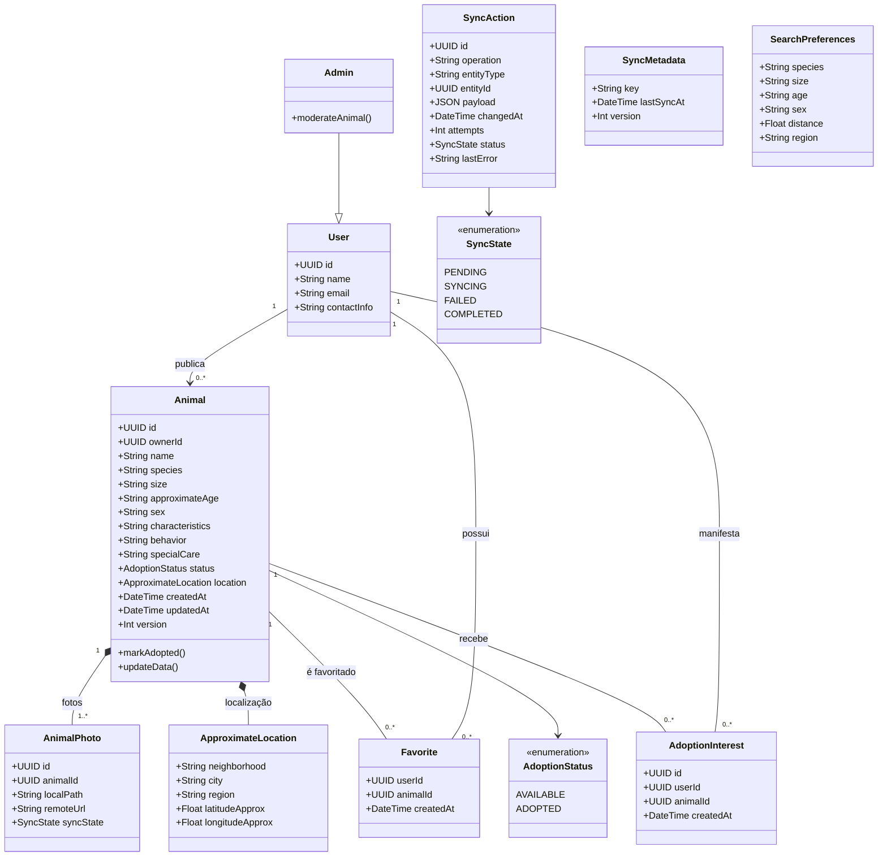

## 4.2 Persistência

| Classe | Persistente? | Local | Remoto | Observação |
|---|---|---|---|---|
| User/Profile | Sim | sessão/cache conforme necessidade | `profiles` | Identidade vinculada ao Supabase Auth |
| Animal | Sim | SQLite | `animals` | Entidade principal |
| AnimalPhoto | Sim | SQLite (path) | `animal_photos` + Storage | Pode existir localmente antes do upload |
| Favorite | Sim | SQLite | `favorites` | Privado por usuário |
| AdoptionInterest | Sim | opcional/cache | `adoption_interests` | Privado aos usuários autorizados |
| SyncAction | Sim | SQLite | Não diretamente | Fila exclusivamente local |
| SyncMetadata | Sim | SQLite | `sync_metadata` se necessário | Controle de sincronização |
| SearchPreferences | Sim, opcional | SQLite | Não necessário | Preferências e filtros |
| ApproximateLocation | Value Object | embutido | embutido em `animals` | Nunca expor endereço exato |

---

# 5. Diagrama Entidade-Relacionamento — DER

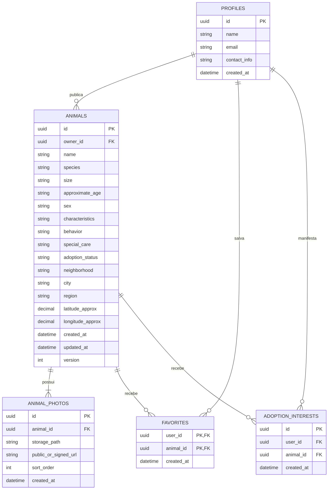

## 5.1 Estruturas locais adicionais

O SQLite também deve conter estruturas que não precisam existir como tabelas de negócio remotas:

```text
sync_queue
- id
- operation
- entity_type
- entity_id
- payload_json
- changed_at
- attempts
- status
- last_error

local_images
- id
- animal_local_or_remote_id
- local_path
- remote_url
- upload_status

sync_state
- key
- last_sync_at
- last_success_at

search_preferences
- filtros/preferências definidos pelo usuário
```

---

# 6. Diagrama de objetos

Exemplo de um instante do sistema após um usuário favoritar um animal:

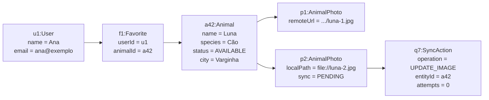

O exemplo valida:
- um usuário pode possuir favoritos;
- um animal pode possuir várias fotos;
- uma foto pode ainda existir apenas localmente;
- uma ação de sincronização pode representar trabalho ainda pendente.

---

# 7. Diagramas de estados

## 7.1 Estado da adoção do animal

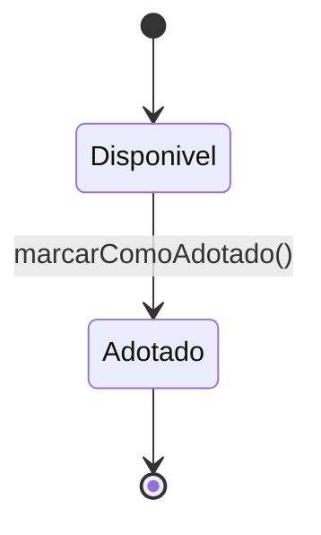

A especificação atual define somente os estados **Disponível para adoção** e **Adotado**. Não foram adicionados estados intermediários não previstos.

## 7.2 Estado de uma ação de sincronização

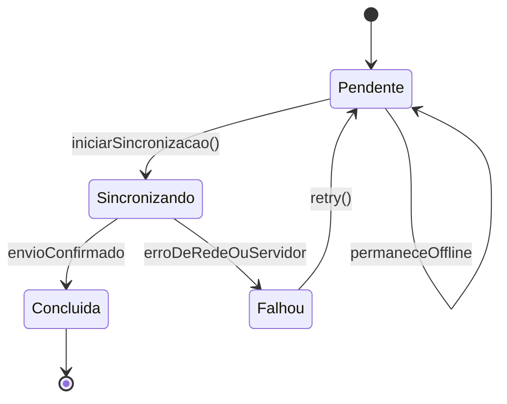

Esse ciclo representa diretamente o comportamento offline-first e o reenvio de operações com falha.

---

# 8. Boundary / Control / Entity

| Caso de uso | Boundary | Control / Use Case | Entidades |
|---|---|---|---|
| Consultar animais | HomeScreen, SearchScreen | ListAnimalsUseCase | Animal |
| Pesquisar/filtrar | SearchScreen, MapScreen | SearchAnimalsUseCase | Animal, SearchPreferences |
| Visualizar detalhes | AnimalDetailsScreen | GetAnimalDetailsUseCase | Animal, AnimalPhoto |
| Autenticar | LoginScreen, RegisterScreen | AuthenticateUserUseCase | User |
| Criar anúncio | NewAnimalScreen | CreateAnimalUseCase | Animal, AnimalPhoto, SyncAction |
| Editar anúncio | EditAnimalScreen | UpdateAnimalUseCase | Animal, AnimalPhoto, SyncAction |
| Excluir anúncio | MyAnimalsScreen | DeleteAnimalUseCase | Animal, SyncAction |
| Marcar adotado | AnimalManagementScreen | MarkAnimalAdoptedUseCase | Animal, SyncAction |
| Favoritos | FavoritesScreen | ToggleFavoriteUseCase | Favorite, Animal |
| Interesse | AnimalDetailsScreen | RegisterAdoptionInterestUseCase | AdoptionInterest, Animal |
| Sincronização | SyncStatusView | ProcessSyncQueueUseCase | SyncAction, SyncMetadata, AnimalPhoto |
| Revisar conflito | ConflictReviewScreen | ResolveSyncConflictUseCase | Animal, SyncAction |
| Moderação | AdminModerationView | ModerateAnimalUseCase | Animal, User |

## 8.1 Robustez — criação de anúncio

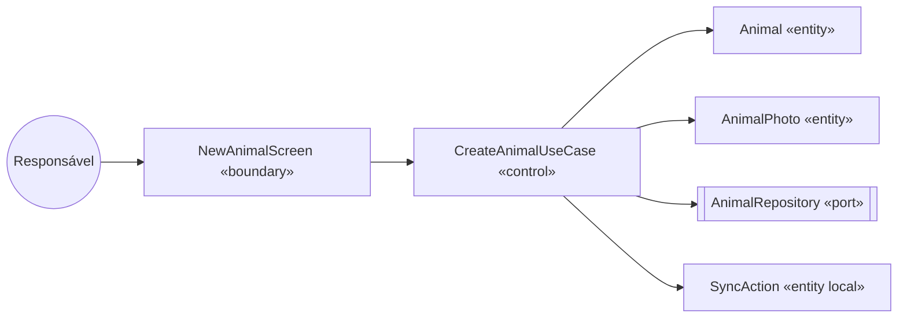

---

# 9. Diagramas de sequência

## 9.1 Consulta de animais

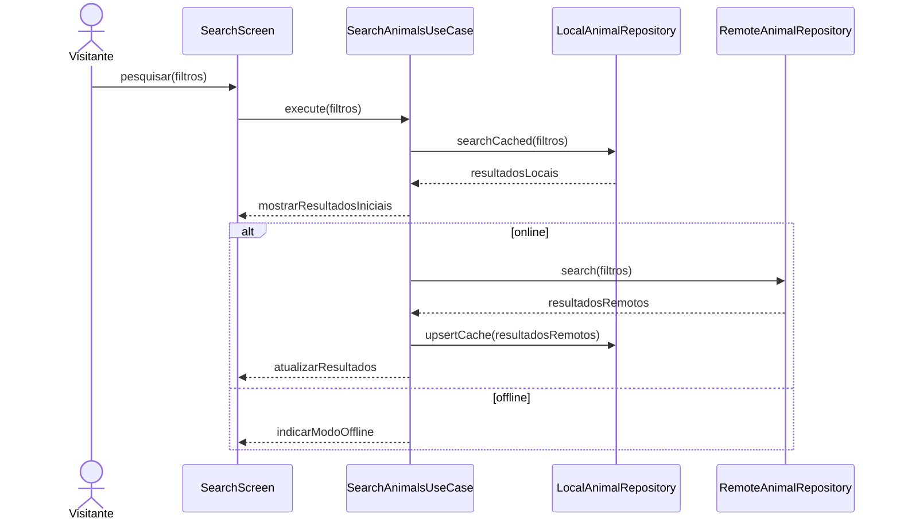

## 9.2 Criação de anúncio offline-first

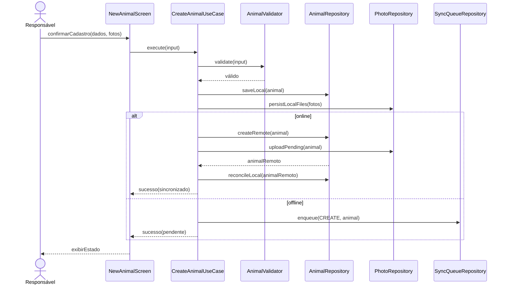

## 9.3 Processamento da fila de sincronização

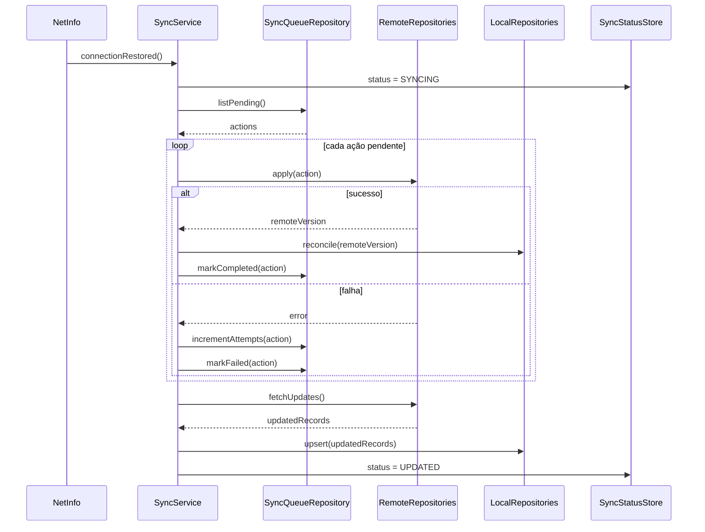

## 9.4 Conflito de versão

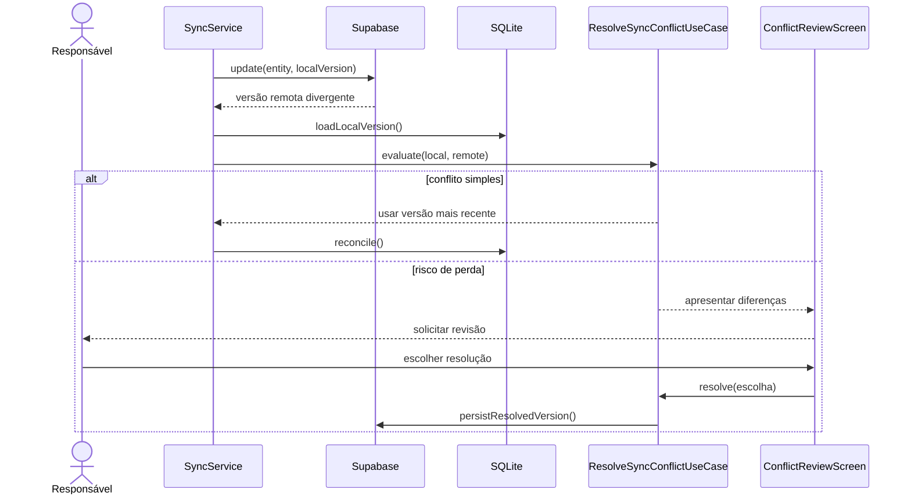

---

# 10. Diagramas de atividades

## 10.1 Pesquisa de animais

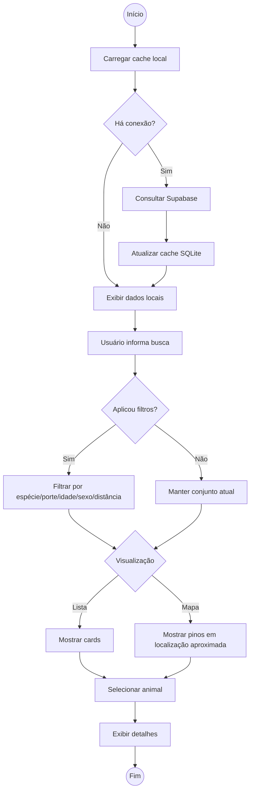

## 10.2 Publicação e sincronização

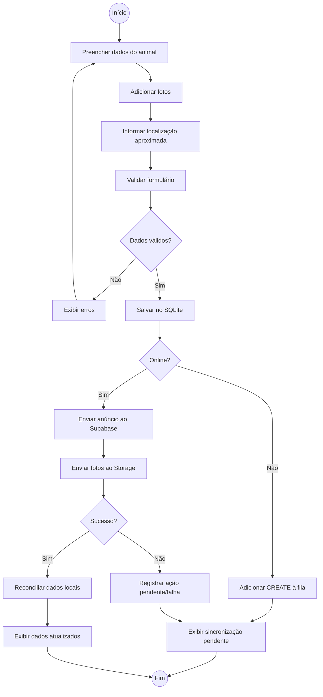

---

# 11. Diagrama de componentes

```mermaid
flowchart TB
    subgraph UI["Frameworks / UI"]
        Expo[Expo Router]
        Screens[Telas React Native]
        NetInfo[NetInfo]
        Camera[Câmera / Galeria]
        Geo[Geolocalização]
    end

    subgraph Adapters["Interface Adapters"]
        Controllers[Controllers / Hooks de feature]
        LocalAdapters[SQLite Repositories]
        RemoteAdapters[Supabase Repositories]
        PhotoAdapter[Photo Storage Adapter]
        AuthAdapter[Supabase Auth Adapter]
        LocationAdapter[Location Adapter]
    end

    subgraph Application["Application / Use Cases"]
        SearchUC[SearchAnimalsUseCase]
        CreateUC[CreateAnimalUseCase]
        UpdateUC[UpdateAnimalUseCase]
        FavoriteUC[ToggleFavoriteUseCase]
        InterestUC[RegisterAdoptionInterestUseCase]
        SyncUC[ProcessSyncQueueUseCase]
        ConflictUC[ResolveSyncConflictUseCase]
    end

    subgraph Domain["Domain"]
        AnimalD[Animal]
        UserD[User]
        FavoriteD[Favorite]
        InterestD[AdoptionInterest]
        SyncD[SyncAction]
        Ports[[Repository / Service Ports]]
    end

    subgraph Infra["External Systems"]
        SQLite[(SQLite)]
        SupabaseDB[(Supabase PostgreSQL)]
        SupabaseStorage[(Supabase Storage)]
        SupabaseAuth[(Supabase Auth)]
    end

    Expo --> Screens
    Screens --> Controllers
    Controllers --> Application

    SearchUC --> AnimalD
    CreateUC --> AnimalD
    UpdateUC --> AnimalD
    FavoriteUC --> FavoriteD
    InterestUC --> InterestD
    SyncUC --> SyncD
    ConflictUC --> AnimalD

    Application --> Ports

    LocalAdapters -. implementa .-> Ports
    RemoteAdapters -. implementa .-> Ports
    PhotoAdapter -. implementa .-> Ports
    AuthAdapter -. implementa .-> Ports
    LocationAdapter -. implementa .-> Ports

    LocalAdapters --> SQLite
    RemoteAdapters --> SupabaseDB
    PhotoAdapter --> SupabaseStorage
    AuthAdapter --> SupabaseAuth

    NetInfo --> Controllers
    Camera --> PhotoAdapter
    Geo --> LocationAdapter
```

**Regra de dependência:** `Domain` não conhece Expo, Supabase, SQLite, câmera, localização ou rede. `Application` depende de interfaces, e as implementações concretas ficam nas camadas externas.

---

# 12. DDD — mapeamento do domínio

## 12.1 Linguagem ubíqua

Termos principais do domínio:

- Animal
- Anúncio de adoção
- Responsável
- Interessado
- Favorito
- Manifestação de interesse
- Disponível
- Adotado
- Localização aproximada
- Ação pendente
- Sincronização
- Conflito de versão
- Foto pendente de upload

## 12.2 Aggregates

| Aggregate Root | Entidades internas / relações | Value Objects | Repository |
|---|---|---|---|
| Animal | AnimalPhoto | ApproximateLocation, AdoptionStatus, AnimalCharacteristics | AnimalRepository |
| User/Profile | Favorite, AdoptionInterest como relações do usuário | ContactInfo | UserRepository |
| SyncAction | dados da operação pendente | SyncState, OperationType | SyncQueueRepository |

### Decisão proposta

`Animal` é a principal raiz de agregado. Fotos devem ser manipuladas por meio do anúncio/animal a que pertencem. A regra “somente o responsável pode alterar ou mudar o status” deve ser aplicada no caso de uso e protegida novamente por RLS no banco remoto.

`SyncAction` é um agregado técnico local, pois possui identidade, tentativas, estado e ciclo de vida próprios.

---

# 13. Clean Architecture — estrutura proposta

A estrutura original com Expo Router, `components`, `features`, `database`, `repositories`, `services`, `hooks`, `stores`, `types` e `utils` pode ser mantida, mas as dependências devem seguir as camadas abaixo.

```text
app/
  (public)/
  (tabs)/
  (protected)/
  _layout.tsx

src/
  domain/
    entities/
      Animal.ts
      User.ts
      Favorite.ts
      AdoptionInterest.ts
      SyncAction.ts
    value-objects/
      ApproximateLocation.ts
      AnimalCharacteristics.ts
    ports/
      AnimalRepository.ts
      UserRepository.ts
      FavoriteRepository.ts
      AdoptionInterestRepository.ts
      SyncQueueRepository.ts
      PhotoStorage.ts
      AuthGateway.ts
      LocationGateway.ts

  application/
    use-cases/
      SearchAnimalsUseCase.ts
      GetAnimalDetailsUseCase.ts
      CreateAnimalUseCase.ts
      UpdateAnimalUseCase.ts
      DeleteAnimalUseCase.ts
      MarkAnimalAdoptedUseCase.ts
      ToggleFavoriteUseCase.ts
      RegisterAdoptionInterestUseCase.ts
      ProcessSyncQueueUseCase.ts
      ResolveSyncConflictUseCase.ts

  features/
    animals/
      screens/
      components/
      controllers/
    search/
    favorites/
    auth/
    sync/

  infrastructure/
    database/
      sqlite/
        migrations/
        repositories/
    supabase/
      client.ts
      repositories/
      auth/
      storage/
    device/
      camera/
      location/
      connectivity/

  stores/
  hooks/
  types/
  utils/
```

## 13.1 Regras

1. `domain/` não importa bibliotecas de infraestrutura.
2. `application/` conhece somente domínio e ports.
3. `features/` transforma eventos de UI em chamadas de caso de uso.
4. `infrastructure/` implementa ports.
5. `app/` contém roteamento e composição de telas.
6. Nenhum componente visual acessa Supabase ou SQLite diretamente.
7. O serviço de sincronização usa repositories abstratos, permitindo testes in-memory.

---

# 14. Estratégia de sincronização

## 14.1 Ordem recomendada

1. Detectar recuperação de conectividade.
2. Bloquear processamento concorrente da mesma fila.
3. Ler ações `PENDING`/`FAILED` elegíveis.
4. Processar mutações locais primeiro.
5. Fazer upload das imagens necessárias.
6. Atualizar referências remotas no SQLite.
7. Buscar registros remotos modificados após `last_sync_at`.
8. Aplicar reconciliação.
9. Atualizar `last_sync_at`.
10. Atualizar estado global da interface.

## 14.2 Estrutura do item de fila

```ts
type SyncAction = {
  id: string;
  operation: 'CREATE' | 'UPDATE' | 'DELETE' | 'MARK_ADOPTED' | 'UPLOAD_PHOTO';
  entityType: 'animal' | 'photo' | 'favorite' | 'interest';
  entityId: string;
  payload: unknown;
  changedAt: string;
  attempts: number;
  status: 'PENDING' | 'SYNCING' | 'FAILED' | 'COMPLETED';
  lastError?: string;
};
```

## 14.3 Conflitos

Regra já prevista no projeto:

- cada anúncio possui `created_at`, `updated_at` e `version`;
- conflito simples pode usar a versão mais recente;
- quando a decisão puder descartar informação relevante, o responsável deve revisar.

Para implementação, recomenda-se que o servidor rejeite `UPDATE` com `version` antiga e retorne a versão atual, evitando que dois clientes sobrescrevam alterações silenciosamente.

---

# 15. Segurança e RLS

## 15.1 Regras mínimas

| Recurso | SELECT | INSERT | UPDATE/DELETE |
|---|---|---|---|
| `animals` ativos | Público | Autenticado | Somente proprietário; admin conforme política |
| `animal_photos` | conforme anúncio | Proprietário | Proprietário |
| `profiles` | conforme necessidade pública | próprio usuário | próprio usuário |
| `favorites` | próprio usuário | próprio usuário | próprio usuário |
| `adoption_interests` | usuários autorizados | próprio usuário | próprio usuário / regra definida |
| moderação | Admin | Admin | Admin |

## 15.2 Localização

A aplicação não deve enviar ao cliente público um endereço residencial exato. O modelo público deve usar cidade, bairro/região ou coordenadas aproximadas.

## 15.3 Defesa em profundidade

A validação de propriedade deve existir:
1. no caso de uso;
2. no repository remoto;
3. nas políticas RLS.

A UI nunca deve ser considerada uma barreira de segurança.

---

# 16. Plano TDD

Ciclo recomendado para cada regra:

1. **Red** — escrever teste que falha.
2. **Green** — implementar o mínimo.
3. **Refactor** — melhorar mantendo o teste verde.
4. Testar caso de uso com repositories in-memory.
5. Testar adapters SQLite/Supabase separadamente.
6. Manter poucos testes E2E para fluxos críticos.

## 16.1 Testes de domínio

### Animal

- deve iniciar disponível;
- deve permitir transição de disponível para adotado;
- deve impedir transição inválida não prevista;
- deve preservar localização aproximada, sem exigir endereço exato;
- deve incrementar/controlar `version` conforme política definida.

### SyncAction

- deve iniciar pendente;
- deve incrementar tentativas após falha;
- deve permitir retry;
- deve finalizar quando sincronizado.

## 16.2 Testes de casos de uso

| Teste | Requisitos cobertos |
|---|---|
| `SearchAnimalsUseCase_returns_cached_results_when_offline` | RF01, RF03, RF04, RF17, RNF01 |
| `SearchAnimalsUseCase_refreshes_cache_when_online` | RF01, RF03, RF20 |
| `CreateAnimalUseCase_persists_remote_when_online` | RF08, RF09 |
| `CreateAnimalUseCase_enqueues_when_offline` | RF18, RF19, RF26 |
| `UpdateAnimalUseCase_rejects_non_owner` | RF10, RNF04 |
| `DeleteAnimalUseCase_rejects_non_owner` | RF11, RNF04 |
| `MarkAnimalAdoptedUseCase_changes_only_owned_animal` | RF12 |
| `ToggleFavoriteUseCase_requires_authenticated_user` | RF14 |
| `RegisterAdoptionInterestUseCase_creates_private_relation` | RF16, RNF04 |
| `ProcessSyncQueueUseCase_retries_failed_action` | RF20, RF21, RNF08 |
| `ProcessSyncQueueUseCase_uploads_local_photo_before_reconcile` | RF26 |
| `ResolveSyncConflictUseCase_requests_review_when_data_may_be_lost` | RF23, RNF02, RNF03 |
| `ModerateAnimalUseCase_rejects_non_admin` | RF27 |

## 16.3 Testes de integração

### SQLite
- migrations criam todas as tabelas;
- cache persiste após reinício;
- fila mantém payload e tentativas;
- transações preservam consistência entre anúncio e ação pendente.

### Supabase
- RLS permite leitura pública de anúncio ativo;
- RLS bloqueia edição por terceiro;
- RLS protege favoritos;
- RLS protege interesses;
- upload de foto associa arquivo ao anúncio correto;
- atualização concorrente respeita controle de versão.

### Dispositivo
- recusa de permissão de localização não quebra a busca;
- recusa de câmera permite usar galeria quando aplicável;
- alteração de conectividade dispara sincronização uma única vez por ciclo.

## 16.4 E2E prioritários

1. Visitante pesquisa e abre um animal.
2. Usuário autentica e favorita um anúncio.
3. Responsável cria anúncio online.
4. Responsável cria anúncio offline, fecha o app, abre novamente e sincroniza.
5. Responsável edita offline e a alteração chega ao servidor.
6. Duas versões do mesmo anúncio geram fluxo de conflito.
7. Responsável marca animal como adotado.
8. Usuário não consegue editar anúncio de terceiro.

---

# 17. Matriz de rastreabilidade

| RF | Caso(s) de uso | Domínio principal | Teste principal |
|---|---|---|---|
| RF01 | UC01 | Animal | busca pública |
| RF02 | UC01 | Animal | listagem inicial |
| RF03 | UC02 | Animal | busca textual/localização |
| RF04 | UC03 | Animal, SearchPreferences | filtros |
| RF05 | UC04 | Animal, ApproximateLocation | lista/mapa |
| RF06 | UC05 | Animal, AnimalPhoto | detalhes |
| RF07 | UC06 | User | autenticação |
| RF08 | UC07 | Animal | criar anúncio |
| RF09 | UC08 | AnimalPhoto | câmera/galeria |
| RF10 | UC09 | Animal | editar próprio |
| RF11 | UC10 | Animal | excluir próprio |
| RF12 | UC11 | Animal | marcar adotado |
| RF13 | UC12 | Animal | meus anúncios |
| RF14 | UC13 | Favorite | favoritar |
| RF15 | UC13 | Favorite | listar favoritos |
| RF16 | UC14 | AdoptionInterest | interesse |
| RF17 | UC15 | Animal, Favorite | cache offline |
| RF18 | UC16 | Animal, SyncAction | mutação offline |
| RF19 | UC16 | SyncAction | enqueue |
| RF20 | UC17 | SyncAction | sync automático |
| RF21 | UC17 | SyncAction | retry |
| RF22 | UC17 | SyncMetadata | feedback de estado |
| RF23 | UC18 | Animal, SyncAction | conflito |
| RF24 | UC19 | ApproximateLocation | captura pontual |
| RF25 | UC04, UC05 | ApproximateLocation | privacidade mapa |
| RF26 | UC07, UC17 | AnimalPhoto, SyncAction | upload pendente |
| RF27 | UC20 | Admin, Animal | moderação |

---

# 18. Decisões arquiteturais consolidadas

1. **Expo Router** organiza rotas públicas, tabs e rotas protegidas.
2. **SQLite é fonte operacional local** para cache e trabalho offline.
3. **Supabase é fonte remota compartilhada** para dados, autenticação e fotos.
4. **Fila local é obrigatória** para toda mutação que precise sobreviver à ausência de rede.
5. **Sincronização é idempotente sempre que possível**.
6. **Controle de versão** protege contra sobrescrita concorrente.
7. **Localização é aproximada e pontual**.
8. **Nenhum matching automático** faz parte do escopo.
9. **RLS é a barreira final de autorização**.
10. **Use cases não conhecem SDKs externos**.
11. **Adapters locais e remotos implementam as mesmas interfaces de acesso ao domínio**.
12. **A UI informa explicitamente o estado de conectividade e sincronização**.

---

# 19. Pontos ainda não definidos pela especificação

Os itens abaixo não devem ser inventados na implementação sem decisão de produto:

- método exato de autenticação no Supabase (e-mail/senha, magic link, OAuth etc.);
- campos obrigatórios e limites de tamanho de cada formulário;
- regras de exclusão de anúncio já adotado;
- possibilidade de reabrir um animal de “Adotado” para “Disponível”;
- tipos de ação de moderação administrativa;
- visibilidade exata dos dados de contato;
- política de retenção de manifestações de interesse;
- limite de fotos por anúncio;
- raio máximo de pesquisa;
- precisão exata usada para arredondar/anonimizar coordenadas;
- política definitiva para conflito simples versus conflito que exige revisão;
- quais mutações de favoritos/interesses terão suporte offline completo.

---

# 20. Checklist da skill

- [x] Requisitos funcionais e não funcionais
- [x] Diagrama de casos de uso com atores, herança, `include` e `extend`
- [x] Descrições textuais dos casos de uso principais
- [x] Diagrama de classes com multiplicidades, composição e herança
- [x] Mapeamento de persistência
- [x] DER
- [x] Diagrama de objetos
- [x] Diagramas de estado aplicáveis
- [x] Boundary / Control / Entity
- [x] Diagramas de sequência
- [x] Diagramas de atividades
- [x] Diagrama de componentes
- [x] Mapeamento DDD
- [x] Estrutura Clean Architecture
- [x] Plano TDD
- [x] Matriz de rastreabilidade RF → UC → domínio → teste

---

# 21. Conclusão

A arquitetura proposta mantém o aplicativo coerente com sua principal restrição de produto: oferecer uma rede de adoção simples, pesquisável e utilizável mesmo em cenários de conectividade limitada.

O centro do domínio é o anúncio/animal, enquanto a infraestrutura offline é tratada como preocupação explícita por meio de cache, fila de sincronização, persistência de imagens locais, controle de versão e reconciliação. A separação em Clean Architecture permite que SQLite, Supabase e APIs do dispositivo permaneçam substituíveis sem contaminar as regras de negócio.

A documentação também mantém rastreabilidade entre requisitos, casos de uso, entidades e testes, permitindo que a implementação avance de forma incremental usando TDD.
