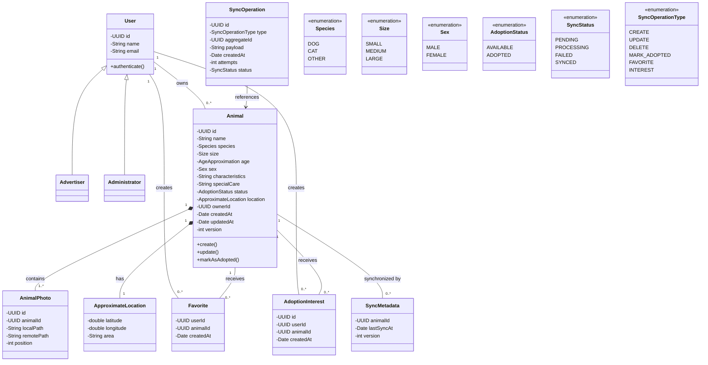
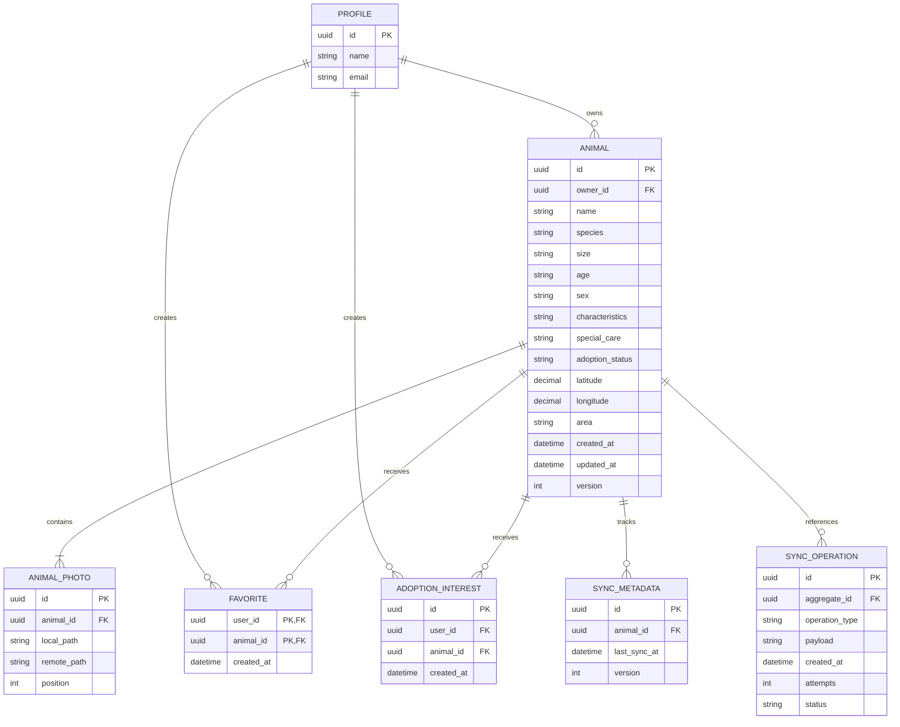
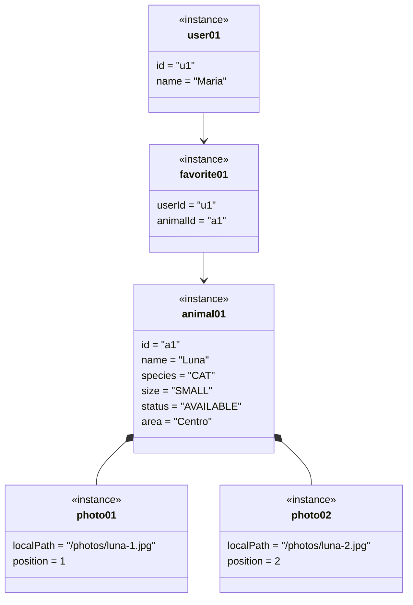
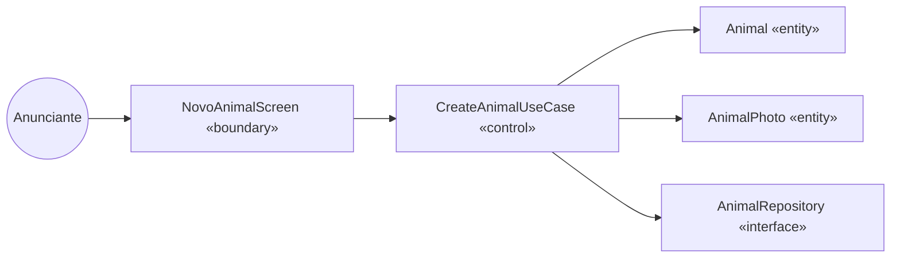
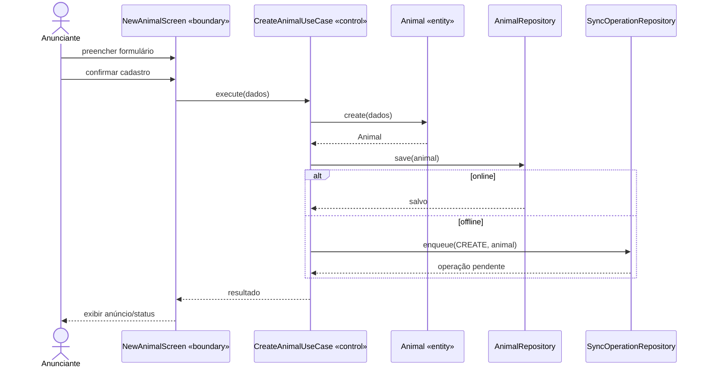
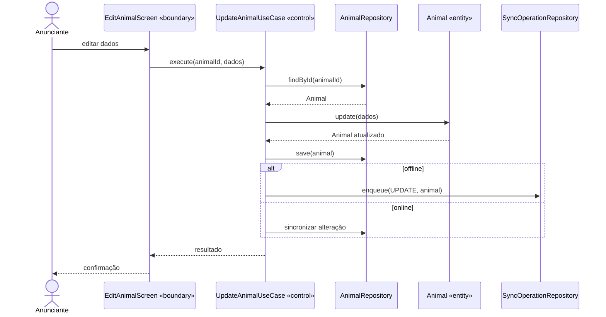
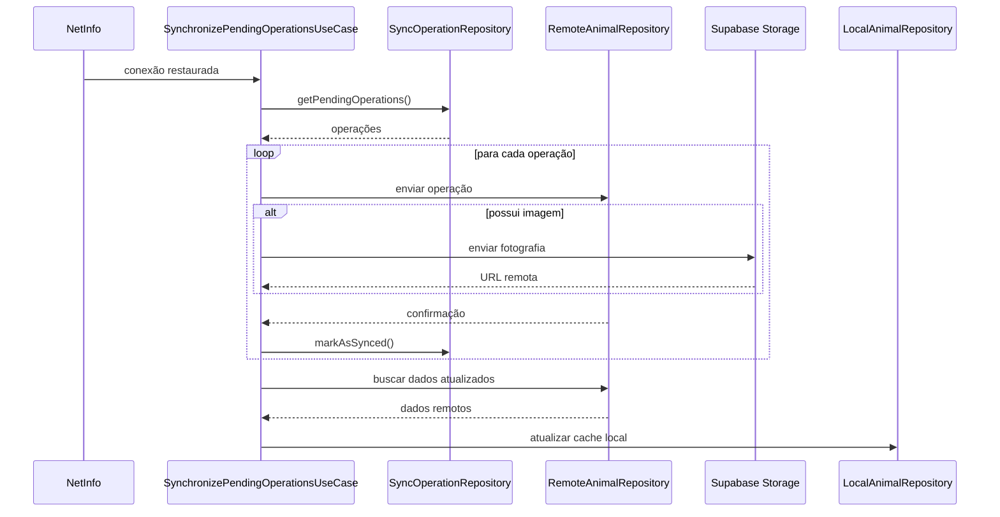
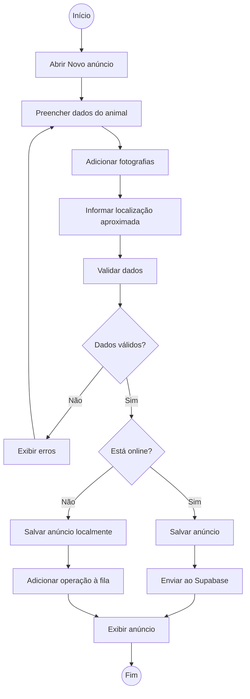
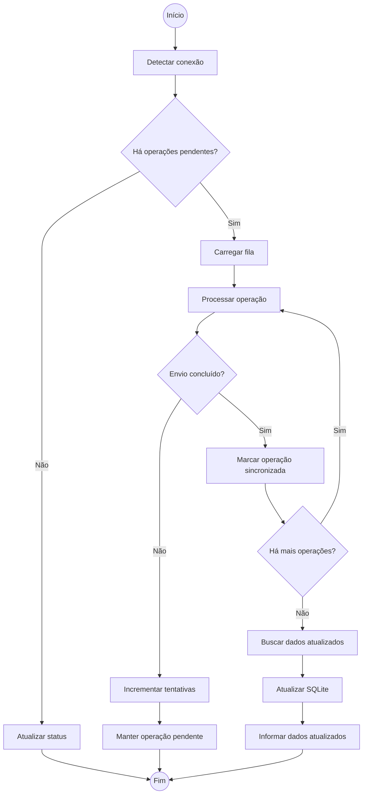
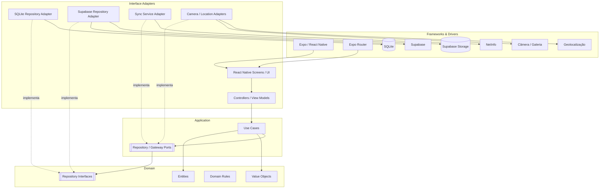

# Documento de Análise e Projeto de Software
## Rede de Adoção de Animais

> Documento elaborado segundo a skill `software-design-doc`, seguindo a ordem requisito → casos de uso → classes → estados → BCE → sequência → atividades → componentes → DDD → Clean Architecture → TDD.

---

# 1. Levantamento de Requisitos

## 1.1 Escopo

O sistema é uma plataforma móvel para divulgação de animais disponíveis para adoção, aproximando pessoas interessadas em adotar de protetores independentes, ONGs, abrigos e tutores responsáveis pela divulgação dos animais.

A consulta aos animais disponíveis será pública. Usuários autenticados poderão publicar, editar e gerenciar seus próprios anúncios, salvar favoritos, manifestar interesse e marcar animais como adotados.

O sistema não realizará correspondência automática entre animais e interessados. A descoberta será feita pelo próprio usuário por meio de pesquisa, filtros, lista e mapa interativo.

O aplicativo adotará estratégia **offline-first**, permitindo consultar dados previamente carregados, favoritos e próprios anúncios sem conexão, além de criar ou editar publicações offline. Alterações serão armazenadas localmente e posteriormente sincronizadas com o Supabase.

## 1.2 Requisitos Funcionais

| ID | Descrição | Prioridade | Ator/Origem |
|---|---|---|---|
| RF01 | O sistema deve permitir consultar anúncios de animais disponíveis sem autenticação. | Alta | Visitante |
| RF02 | O sistema deve permitir pesquisar anúncios por nome ou localização. | Alta | Usuário |
| RF03 | O sistema deve permitir filtrar anúncios por espécie, porte, idade, sexo e distância. | Alta | Usuário |
| RF04 | O sistema deve permitir alternar entre visualização em lista e mapa. | Alta | Usuário |
| RF05 | O sistema deve permitir visualizar os detalhes de um animal, incluindo fotos, características, cuidados, localização aproximada e contato. | Alta | Usuário |
| RF06 | O sistema deve permitir cadastrar uma conta de usuário. | Alta | Usuário |
| RF07 | O sistema deve permitir autenticar um usuário. | Alta | Usuário |
| RF08 | O sistema deve permitir criar um anúncio de adoção para um animal. | Alta | Usuário autenticado |
| RF09 | O sistema deve permitir adicionar uma ou mais fotos a um anúncio. | Alta | Usuário autenticado |
| RF10 | O sistema deve permitir editar um anúncio pertencente ao usuário autenticado. | Alta | Usuário autenticado |
| RF11 | O sistema deve permitir excluir um anúncio pertencente ao usuário autenticado. | Média | Usuário autenticado |
| RF12 | O sistema deve permitir visualizar e gerenciar os próprios anúncios. | Alta | Usuário autenticado |
| RF13 | O sistema deve permitir salvar um anúncio como favorito. | Média | Usuário autenticado |
| RF14 | O sistema deve permitir consultar os anúncios favoritos. | Média | Usuário autenticado |
| RF15 | O sistema deve permitir manifestar interesse na adoção de um animal. | Alta | Usuário autenticado |
| RF16 | O sistema deve permitir ao responsável pelo anúncio marcar o animal como adotado. | Alta | Responsável pelo anúncio |
| RF17 | O sistema deve permitir consultar animais próximos utilizando localização. | Alta | Usuário |
| RF18 | O sistema deve permitir visualizar anúncios em mapa utilizando localização aproximada. | Alta | Usuário |
| RF19 | O sistema deve permitir criar e editar anúncios sem conexão, para usuários autenticados. | Alta | Usuário autenticado |
| RF20 | O sistema deve armazenar localmente operações realizadas offline que ainda não foram sincronizadas. | Alta | Sistema |
| RF21 | O sistema deve sincronizar automaticamente operações pendentes quando a conexão for restabelecida. | Alta | Sistema |
| RF22 | O sistema deve permitir tentar novamente uma sincronização que falhou. | Média | Usuário autenticado |
| RF23 | O sistema deve informar o estado de sincronização ao usuário. | Alta | Sistema |
| RF24 | O sistema deve preservar a localização aproximada do animal, sem revelar o endereço exato do responsável. | Alta | Sistema |
| RF25 | O sistema deve permitir que administradores moderem anúncios inadequados. | Média | Administrador |

## 1.3 Requisitos Não Funcionais

| ID | Categoria | Descrição / Critério |
|---|---|---|
| RNF01 | Arquitetura | A aplicação deve seguir Clean Architecture, mantendo o domínio independente de frameworks, banco de dados e serviços externos. |
| RNF02 | Offline | As operações previstas para uso offline devem funcionar sem conexão e permanecer disponíveis no dispositivo. |
| RNF03 | Persistência | Dados offline devem ser persistidos em SQLite. |
| RNF04 | Backend | Dados remotos, autenticação e armazenamento de fotografias devem utilizar Supabase. |
| RNF05 | Sincronização | Operações pendentes devem ser mantidas em fila local até confirmação de envio ao servidor. |
| RNF06 | Confiabilidade | Uma falha de sincronização não deve apagar a operação pendente; ela deve permanecer disponível para nova tentativa. |
| RNF07 | Concorrência | Anúncios devem possuir `created_at`, `updated_at` e `version` para identificação de alterações concorrentes. |
| RNF08 | Segurança | O endereço exato do responsável não deve ser exposto no mapa. |
| RNF09 | Autorização | Somente usuários autenticados podem publicar, editar/excluir publicações, marcar animais como adotados, salvar favoritos e manifestar interesse. |
| RNF10 | Autorização | Um usuário deve poder alterar somente os próprios anúncios, salvo regras administrativas. |
| RNF11 | Privacidade | A localização usada no mapa deve ser aproximada por bairro ou área geográfica. |
| RNF12 | Usabilidade | O aplicativo deve indicar claramente estados como offline, alterações salvas, sincronização pendente, sincronizando e dados atualizados. |
| RNF13 | Portabilidade | O aplicativo deve ser implementado como aplicação móvel utilizando React Native e Expo Router. |
| RNF14 | Integração | A câmera e a galeria devem poder fornecer imagens para anúncios; a geolocalização deve ser capturada pontualmente. |
| RNF15 | Arquitetura de dados | O acesso a SQLite, Supabase, Storage, câmera e localização deve ficar fora do domínio. |
| RNF16 | Manutenibilidade | As funcionalidades devem ser separadas por domínio/feature e as dependências devem respeitar a direção definida pela Clean Architecture. |

### Rastreabilidade dos requisitos

Cada RF é candidato a pelo menos um caso de uso. Cada RNF funciona como restrição para arquitetura, persistência, segurança, sincronização ou apresentação.

---

# 2. Diagrama de Casos de Uso

## 2.1 Atores

- **Visitante** — consulta anúncios públicos.
- **Usuário** — ator autenticado que pesquisa, favorita e manifesta interesse.
- **Anunciante** — usuário responsável por anúncios; possui permissões de gerenciamento.
- **Administrador** — usuário especializado com capacidade de moderação.
- **Sistema de Sincronização** — processo interno responsável por sincronizar operações pendentes.
- **Serviço de Localização** — sistema externo utilizado para obter localização.
- **Câmera/Galeria** — sistemas externos utilizados para obtenção de fotografias.
- **Supabase** — sistema externo responsável por autenticação, banco remoto e Storage.

## 2.2 Generalização de atores

`Anunciante` e `Administrador` são especializações de `Usuário`.

```mermaid
flowchart LR
    Visitante((Visitante))
    Usuario((Usuário))
    Anunciante((Anunciante))
    Admin((Administrador))

    Anunciante --|> Usuario
    Admin --|> Usuario

    Visitante --> Consultar
    Usuario --> Pesquisar
    Usuario --> Filtrar
    Usuario --> Visualizar
    Usuario --> Favoritar
    Usuario --> Interesse
    Usuario --> Localizacao

    Anunciante --> Criar
    Anunciante --> Editar
    Anunciante --> Excluir
    Anunciante --> Gerenciar
    Anunciante --> Adotado

    Admin --> Moderar

    Criar --> Fotos
    Criar --> Local
    Pesquisar -.include.-> Filtrar
    Visualizar -.extend.-> Mapa
    Criar -.include.-> Validar
    Editar -.include.-> Validar
```

## 2.3 Casos de uso e relações

### Casos principais

- UC01 Consultar anúncios
- UC02 Pesquisar anúncios
- UC03 Filtrar anúncios
- UC04 Visualizar detalhes do animal
- UC05 Visualizar anúncios no mapa
- UC06 Cadastrar usuário
- UC07 Fazer login
- UC08 Criar anúncio
- UC09 Adicionar fotos
- UC10 Editar anúncio
- UC11 Excluir anúncio
- UC12 Gerenciar meus anúncios
- UC13 Favoritar anúncio
- UC14 Consultar favoritos
- UC15 Manifestar interesse
- UC16 Marcar animal como adotado
- UC17 Consultar animais próximos
- UC18 Sincronizar operações pendentes
- UC19 Reenviar sincronização
- UC20 Visualizar status de sincronização
- UC21 Moderar anúncio

### Include

- Criar anúncio `<<include>>` Validar dados do anúncio.
- Editar anúncio `<<include>>` Validar dados do anúncio.
- Criar anúncio `<<include>>` Adicionar fotos, quando houver fotografia no cadastro.
- Criar anúncio `<<include>>` Capturar localização, quando o usuário fornecer localização.
- Sincronizar operações `<<include>>` Processar fila de operações.

### Extend

- Visualizar detalhes `<<extend>>` Visualizar mapa, quando o usuário solicitar a localização.
- Consultar anúncios `<<extend>>` Filtrar anúncios, quando filtros forem aplicados.
- Sincronizar operações `<<extend>>` Reenviar operação, quando uma operação anterior tiver falhado.

> `include` representa comportamento obrigatório para completar o caso-base; `extend` representa comportamento opcional ou condicionado.

## 2.4 Descrição textual dos casos de uso principais

### UC01 — Consultar anúncios

**Ator:** Visitante/Usuário  
**Pré-condição:** nenhuma.  
**Fluxo principal:**
1. Usuário acessa a tela inicial ou busca.
2. Sistema consulta anúncios disponíveis localmente e/ou remotamente.
3. Sistema apresenta os anúncios.
4. Usuário pode selecionar um anúncio para visualizar detalhes.

**Fluxos alternativos:**
- Sem conexão: sistema utiliza anúncios previamente carregados.
- Sem dados locais: sistema informa que não há anúncios disponíveis no dispositivo.

**Pós-condição:** anúncios disponíveis são apresentados.

### UC02 — Pesquisar e filtrar anúncios

**Ator:** Usuário  
**Pré-condição:** tela de busca disponível.  
**Fluxo principal:**
1. Usuário informa nome ou localização.
2. Usuário seleciona filtros.
3. Sistema aplica os critérios.
4. Sistema apresenta os resultados em lista.
5. Usuário pode alternar para mapa.

**Pós-condição:** resultados correspondentes aos critérios são apresentados.

### UC08 — Criar anúncio

**Ator:** Anunciante  
**Pré-condição:** usuário autenticado.  
**Fluxo principal:**
1. Usuário acessa Novo anúncio.
2. Sistema apresenta formulário.
3. Usuário informa dados do animal.
4. Usuário adiciona fotos.
5. Usuário informa localização aproximada.
6. Sistema valida os dados.
7. Sistema salva o anúncio.
8. Se estiver offline, registra a operação na fila de sincronização.
9. Se estiver online, envia/sincroniza com o servidor.

**Fluxos alternativos:**
- Dados inválidos: sistema informa os erros e não conclui o cadastro.
- Falha de sincronização: operação permanece pendente.

**Pós-condição:** anúncio é salvo localmente e, quando possível, sincronizado remotamente.

### UC10 — Editar anúncio

**Ator:** Anunciante  
**Pré-condição:** usuário autenticado e anúncio pertencente ao usuário.  
**Fluxo principal:**
1. Usuário seleciona um anúncio próprio.
2. Sistema carrega os dados.
3. Usuário altera os dados.
4. Sistema valida.
5. Sistema salva a nova versão localmente.
6. Operação é enviada imediatamente ou adicionada à fila offline.

**Pós-condição:** anúncio atualizado e marcado para sincronização quando necessário.

### UC13 — Favoritar anúncio

**Ator:** Usuário autenticado  
**Pré-condição:** usuário autenticado e anúncio existente.  
**Fluxo principal:**
1. Usuário seleciona favorito.
2. Sistema registra a relação entre usuário e anúncio.
3. Sistema atualiza a lista de favoritos.
4. Se offline, registra operação pendente.

### UC15 — Manifestar interesse

**Ator:** Usuário autenticado  
**Pré-condição:** anúncio disponível para adoção.  
**Fluxo principal:**
1. Usuário abre os detalhes.
2. Usuário escolhe manifestar interesse.
3. Sistema registra a manifestação associada ao usuário e anúncio.
4. Sistema confirma a operação.

### UC16 — Marcar animal como adotado

**Ator:** Anunciante  
**Pré-condição:** usuário é responsável pelo anúncio.  
**Fluxo principal:**
1. Usuário abre seus anúncios.
2. Seleciona o animal.
3. Solicita alteração para adotado.
4. Sistema valida a autorização.
5. Sistema altera o status.
6. Sistema salva localmente e sincroniza quando possível.

### UC18 — Sincronizar operações pendentes

**Ator:** Sistema de Sincronização  
**Pré-condição:** existe conexão e há operações pendentes.  
**Fluxo principal:**
1. Sistema detecta restabelecimento da conexão.
2. Carrega a fila local.
3. Processa operações pendentes.
4. Envia alterações ao Supabase.
5. Envia fotografias pendentes ao Storage quando aplicável.
6. Atualiza a situação das operações.
7. Busca dados atualizados.
8. Atualiza o SQLite.
9. Informa o novo estado ao usuário.

**Fluxo alternativo — conflito:**
1. Sistema compara `version`/`updated_at`.
2. Em conflito simples, pode prevalecer a versão mais recentemente modificada.
3. Se houver risco de perda de informação importante, sistema sinaliza o responsável para revisão.

---

# 3. Diagrama de Classes

As classes são derivadas dos requisitos e casos de uso. O modelo distingue entidades de domínio, value objects, serviços externos e objetos de infraestrutura.



## 3.1 Relações

### Herança

`Advertiser --|> User` e `Administrator --|> User`.

Representa especialização de papel: anunciante e administrador são usuários.

### Composição

`Animal *-- AnimalPhoto`.

As fotografias fazem parte do anúncio do animal e são gerenciadas junto dele.

`Animal *-- ApproximateLocation`.

A localização é tratada como parte do anúncio e não como entidade independente do domínio do anúncio.

### Agregação/associação

`User -- Favorite` e `Animal -- Favorite` representam relações que conectam usuário e animal sem estabelecer que o ciclo de vida de um seja o ciclo de vida do outro.

`User -- AdoptionInterest` e `Animal -- AdoptionInterest` representam manifestações de interesse.

---

# 4. Persistência

| Classe | Persistente? | Estratégia | Observação |
|---|---|---|---|
| User | Sim | `profiles` no Supabase; dados necessários localmente conforme autenticação | Perfil do usuário |
| Advertiser | Não como tabela independente | Papel/perfil | Especialização de User |
| Administrator | Não como tabela independente | Papel/perfil | Especialização de User |
| Animal | Sim | `animals` / SQLite local | Aggregate Root |
| AnimalPhoto | Sim | `animal_photos` / SQLite local | Referência de imagens |
| Favorite | Sim | `favorites` / SQLite local | Relação usuário-animal |
| AdoptionInterest | Sim | `adoption_interests` | Manifestação de interesse |
| ApproximateLocation | Embutido | Colunas em `animals` | Não é entidade própria |
| SyncOperation | Sim | Fila local SQLite | Operação pendente |
| SyncMetadata | Sim | `sync_metadata` | Controle de sincronização |
| Enums | Não | Colunas | Valores embutidos |

---

# 5. Diagrama Entidade-Relacionamento (DER)

O DER é derivado das classes persistentes. A localização aproximada é embutida em `ANIMAL`; enums são representados como valores de coluna.



### Regras de conversão

- Relações 1:N possuem FK no lado N.
- `Favorite` representa uma relação N:N entre usuário e animal e, portanto, possui tabela associativa.
- `ApproximateLocation` não possui tabela própria, pois é um Value Object embutido em `Animal`.
- `Advertiser` e `Administrator` são papéis de `User`; não é necessária uma tabela separada para cada subclasse.
- `Animal` é a raiz do agregado de anúncio.

---

# 6. Diagrama de Objetos

O diagrama de objetos representa um snapshot concreto para validar composição, agregação e cardinalidades.



O snapshot demonstra que um animal pode possuir múltiplas fotografias e que o favorito é uma relação entre um usuário e um animal.

---

# 7. Diagrama de Estados

A skill determina que esta etapa deve ser avaliada antes de decidir sua aplicação.

A entidade candidata é `Animal`. O documento de requisitos define os estados **Disponível para adoção** e **Adotado**, porém não define um ciclo de vida complexo com diversos estados, guardas, responsáveis ou transições alternativas.

**Conclusão: diagrama de estados não se aplica como diagrama independente obrigatório.**

O atributo `Animal.adoptionStatus` permanece no modelo de classes como enum:

```text
AdoptionStatus
- AVAILABLE
- ADOPTED
```

A regra de negócio relevante será encapsulada no método da entidade `markAsAdopted()`, e não por alteração livre do atributo de status.

---

# 8. Classes de Fronteira, Controle e Entidade (Boundary-Control-Entity)

A separação BCE será mapeada posteriormente para Clean Architecture:

- Boundary → Interface Adapters
- Control → Application / Use Cases
- Entity → Domain

## 8.1 Mapeamento

| Caso de Uso | Boundary | Control | Entities envolvidas |
|---|---|---|---|
| Consultar anúncios | AnimalListScreen | ListAvailableAnimalsUseCase | Animal |
| Pesquisar anúncios | SearchScreen | SearchAnimalsUseCase | Animal |
| Filtrar anúncios | SearchScreen | FilterAnimalsUseCase | Animal |
| Visualizar detalhes | AnimalDetailScreen | GetAnimalDetailsUseCase | Animal, AnimalPhoto |
| Visualizar mapa | AnimalMapScreen | FindNearbyAnimalsUseCase | Animal, ApproximateLocation |
| Cadastrar usuário | RegisterScreen | RegisterUserUseCase | User |
| Fazer login | LoginScreen | LoginUserUseCase | User |
| Criar anúncio | NewAnimalScreen | CreateAnimalUseCase | Animal, AnimalPhoto |
| Editar anúncio | EditAnimalScreen | UpdateAnimalUseCase | Animal, AnimalPhoto |
| Excluir anúncio | MyAnimalsScreen | DeleteAnimalUseCase | Animal |
| Gerenciar meus anúncios | MyAnimalsScreen | ListMyAnimalsUseCase | Animal |
| Favoritar | AnimalDetailScreen | AddFavoriteUseCase | Favorite, Animal |
| Consultar favoritos | FavoritesScreen | ListFavoritesUseCase | Favorite, Animal |
| Manifestar interesse | AnimalDetailScreen | CreateAdoptionInterestUseCase | AdoptionInterest, Animal |
| Marcar adotado | EditAnimalScreen | MarkAnimalAsAdoptedUseCase | Animal |
| Sincronizar | SyncServiceAdapter | SynchronizePendingOperationsUseCase | SyncOperation, Animal |
| Reenviar sincronização | SyncStatusScreen | RetrySyncOperationUseCase | SyncOperation |
| Visualizar status | SyncStatusScreen | GetSyncStatusUseCase | SyncOperation |
| Moderar anúncio | ModerationScreen | ModerateAnimalAdUseCase | Animal |

## 8.2 Diagrama de robustez



---

# 9. Diagramas de Sequência

## 9.1 Criar anúncio



## 9.2 Editar anúncio



## 9.3 Sincronização



---

# 10. Diagramas de Atividades

## 10.1 Criar anúncio



## 10.2 Sincronizar operações



---

# 11. Diagrama de Componentes

O diagrama é derivado da Clean Architecture. A regra de dependência é sempre da camada externa para a interna.



**Regra:** Domain não depende de React Native, Expo, SQLite, Supabase, NetInfo, câmera ou geolocalização. As interfaces ficam nas camadas internas e suas implementações nas camadas externas.

---

# 12. DDD — Domain-Driven Design

## 12.1 Linguagem ubíqua

Os termos do domínio devem ser preservados no código:

- Animal
- Anúncio
- Adoção
- Anunciante
- Interessado
- Favorito
- Interesse na adoção
- Localização aproximada
- Fotografia
- Sincronização
- Operação pendente
- Disponível
- Adotado

Evitar nomes técnicos genéricos como `Manager`, `Helper` ou `Processor` para representar regras de negócio.

## 12.2 Entidades

### Animal

É a principal entidade de domínio, possui identidade própria e ciclo de vida.

### User

Representa o usuário da aplicação.

### AnimalPhoto

Representa uma fotografia pertencente ao anúncio.

### Favorite

Representa o vínculo entre usuário e animal favorito.

### AdoptionInterest

Representa uma manifestação de interesse.

### SyncOperation

Representa uma operação local que precisa ser sincronizada.

## 12.3 Value Objects

### ApproximateLocation

Representa localização sem expor o endereço exato.

```text
ApproximateLocation
- latitude
- longitude
- area
```

O objeto é definido por valor e não precisa existir independentemente do anúncio.

### Enums

Os seguintes valores podem ser tratados como tipos de domínio:

- Species
- Size
- Sex
- AdoptionStatus
- SyncStatus
- SyncOperationType

## 12.4 Aggregate

### Aggregate Root: Animal

```text
Animal
 ├── AnimalPhoto
 └── ApproximateLocation
```

O `Animal` é a raiz do agregado de anúncio. Alterações nas fotografias e localização pertencentes ao anúncio devem ser coordenadas pelo agregado ou por casos de uso apropriados, evitando acesso indiscriminado às entidades internas.

## 12.5 Repositories

De acordo com DDD, o repository pertence à fronteira do domínio/aplicação e sua implementação fica na infraestrutura/interface adapter.

```text
AnimalRepository
UserRepository
FavoriteRepository
AdoptionInterestRepository
SyncOperationRepository
```

O domínio não conhece SQLite nem Supabase.

## 12.6 Domain Services

Não há, no material fornecido, uma regra de negócio que obrigue um Domain Service complexo. As regras apresentadas podem ser mantidas nas entidades e use cases.

A sincronização é uma responsabilidade de aplicação/infraestrutura, não uma regra intrínseca da entidade `Animal`.

---

# 13. Clean Architecture

## 13.1 Regra fundamental

A arquitetura seguirá a dependência:

```text
Frameworks & Drivers
        ↓
Interface Adapters
        ↓
Application
        ↓
Domain
```

A camada interna nunca depende de uma camada externa.

## 13.2 Domain

Responsável por:

- entidades;
- value objects;
- enums de domínio;
- regras de negócio;
- contratos de repositories/gateways necessários ao domínio.

Não pode importar:

- React Native;
- Expo;
- Expo Router;
- SQLite;
- Supabase;
- NetInfo;
- APIs de câmera;
- APIs de localização.

## 13.3 Application

Responsável pelos casos de uso e pela orquestração dos fluxos.

Exemplos:

```text
CreateAnimalUseCase
UpdateAnimalUseCase
DeleteAnimalUseCase
ListAvailableAnimalsUseCase
SearchAnimalsUseCase
FilterAnimalsUseCase
GetAnimalDetailsUseCase
FindNearbyAnimalsUseCase
AddFavoriteUseCase
ListFavoritesUseCase
CreateAdoptionInterestUseCase
MarkAnimalAsAdoptedUseCase
SynchronizePendingOperationsUseCase
RetrySyncOperationUseCase
GetSyncStatusUseCase
RegisterUserUseCase
LoginUserUseCase
ModerateAnimalAdUseCase
```

Os use cases não conhecem a implementação concreta de SQLite ou Supabase.

## 13.4 Interface Adapters

Responsável por adaptar entrada/saída entre UI, casos de uso e infraestrutura.

Exemplos:

```text
screens/
controllers/
view-models/
presenters/
repositories/
adapters/
```

Os adapters de repository convertem chamadas da aplicação para SQLite/Supabase.

## 13.5 Frameworks & Drivers

Responsável pelos detalhes substituíveis:

- Expo;
- React Native;
- Expo Router;
- SQLite;
- Supabase;
- Supabase Storage;
- NetInfo;
- câmera/galeria;
- geolocalização.

## 13.6 Estrutura proposta

```text
src/
├── domain/
│   ├── entities/
│   │   ├── Animal.ts
│   │   ├── User.ts
│   │   ├── AnimalPhoto.ts
│   │   ├── Favorite.ts
│   │   ├── AdoptionInterest.ts
│   │   └── SyncOperation.ts
│   ├── value-objects/
│   │   └── ApproximateLocation.ts
│   ├── enums/
│   ├── repositories/
│   │   ├── AnimalRepository.ts
│   │   ├── UserRepository.ts
│   │   ├── FavoriteRepository.ts
│   │   ├── AdoptionInterestRepository.ts
│   │   └── SyncOperationRepository.ts
│   └── services/
│
├── application/
│   ├── use-cases/
│   │   ├── animals/
│   │   ├── search/
│   │   ├── favorites/
│   │   ├── adoption-interest/
│   │   ├── authentication/
│   │   └── synchronization/
│   └── ports/
│
├── adapters/
│   ├── controllers/
│   ├── repositories/
│   │   ├── SQLiteAnimalRepository.ts
│   │   ├── SupabaseAnimalRepository.ts
│   │   └── SQLiteSyncOperationRepository.ts
│   ├── presenters/
│   └── services/
│       ├── SupabaseAuthAdapter.ts
│       ├── SupabaseStorageAdapter.ts
│       ├── CameraAdapter.ts
│       └── LocationAdapter.ts
│
├── infra/
│   ├── database/
│   │   ├── sqlite.ts
│   │   ├── migrations/
│   │   └── schema/
│   ├── supabase/
│   │   ├── client.ts
│   │   └── config.ts
│   ├── sync/
│   │   └── SyncEngine.ts
│   └── network/
│       └── NetInfoConnection.ts
│
├── components/
├── hooks/
├── stores/
├── types/
└── utils/

app/
├── (public)/
├── (tabs)/
├── (protected)/
├── login.tsx
└── register.tsx
```

### Regra de importação

Permitido:

```text
app → adapters → application → domain
infra → adapters/application/domain contracts
```

Proibido:

```text
domain → React Native
domain → SQLite
domain → Supabase
application → SQLite
application → Supabase
entity → Expo
```

Se um use case precisar persistir um `Animal`, ele recebe uma abstração:

```ts
await animalRepository.save(animal);
```

e não:

```ts
await sqlite.insert(...);
```

---

# 14. Estratégia Offline-First e Sincronização na Clean Architecture

A sincronização é dividida entre Application e Frameworks/Drivers.

## Application

`SynchronizePendingOperationsUseCase`:

1. Obtém operações pendentes.
2. Determina a operação a executar.
3. Usa ports/repositories.
4. Atualiza o estado da operação.
5. Trata conflitos segundo as regras definidas.
6. Solicita atualização dos dados locais.

## Infraestrutura

`SyncEngine`:

- observa conectividade;
- dispara o use case quando a conexão retorna;
- agenda/reexecuta sincronizações;
- integra-se ao NetInfo.

## Persistência local

`SQLiteAnimalRepository` e `SQLiteSyncOperationRepository` implementam os contratos internos.

## Persistência remota

`SupabaseAnimalRepository` e adapters relacionados implementam os contratos necessários para comunicação remota.

---

# 15. TDD — Test-Driven Development

A implementação deve seguir **red → green → refactor**, de dentro para fora:

1. Domain
2. Application
3. Interface Adapters
4. Frameworks/Drivers

## 15.1 Testes de domínio

Exemplos:

```text
Animal.test.ts
ApproximateLocation.test.ts
AdoptionStatus.test.ts
```

Casos:

- criar animal com dados válidos;
- rejeitar dados inválidos;
- alterar dados do animal;
- marcar animal como adotado;
- impedir regra de negócio inválida, caso definida;
- preservar identidade do animal.

## 15.2 Testes dos use cases

Exemplos:

```text
CreateAnimalUseCase.test.ts
UpdateAnimalUseCase.test.ts
DeleteAnimalUseCase.test.ts
ListAvailableAnimalsUseCase.test.ts
SearchAnimalsUseCase.test.ts
FilterAnimalsUseCase.test.ts
AddFavoriteUseCase.test.ts
CreateAdoptionInterestUseCase.test.ts
MarkAnimalAsAdoptedUseCase.test.ts
SynchronizePendingOperationsUseCase.test.ts
RetrySyncOperationUseCase.test.ts
```

Os testes devem utilizar repositories fake/in-memory.

Não testar o use case diretamente contra SQLite ou Supabase.

## 15.3 Testes de adapters

Poucos testes de integração devem verificar:

- mapeamento SQLite ↔ entidades;
- mapeamento Supabase ↔ entidades;
- persistência da fila;
- envio de imagens;
- autenticação;
- integração com NetInfo;
- integração com câmera/localização.

## 15.4 Testes da UI

Testar comportamentos importantes:

- formulário de novo anúncio;
- validação;
- exibição de anúncios;
- favoritos;
- estado offline;
- status de sincronização;
- fluxo de edição.

## 15.5 Pirâmide

```text
        E2E
       /   \
   Integração
  /           \
Domínio + Use Cases
```

A maior quantidade de testes deve estar em domínio e application. Integração deve ser menor e E2E menor ainda.

---

# 16. Rastreabilidade RF → UC → Teste

| Requisito | Caso de uso | Teste principal |
|---|---|---|
| RF01 | UC01 Consultar anúncios | `ListAvailableAnimalsUseCase.test` |
| RF02 | UC02 Pesquisar anúncios | `SearchAnimalsUseCase.test` |
| RF03 | UC03 Filtrar anúncios | `FilterAnimalsUseCase.test` |
| RF04 | UC05 Visualizar mapa | `FindNearbyAnimalsUseCase.test` |
| RF05 | UC04 Visualizar detalhes | `GetAnimalDetailsUseCase.test` |
| RF06 | UC06 Cadastrar usuário | `RegisterUserUseCase.test` |
| RF07 | UC07 Fazer login | `LoginUserUseCase.test` |
| RF08 | UC08 Criar anúncio | `CreateAnimalUseCase.test` |
| RF09 | UC09 Adicionar fotos | `AnimalPhoto` + adapter test |
| RF10 | UC10 Editar anúncio | `UpdateAnimalUseCase.test` |
| RF11 | UC11 Excluir anúncio | `DeleteAnimalUseCase.test` |
| RF12 | UC12 Gerenciar meus anúncios | `ListMyAnimalsUseCase.test` |
| RF13 | UC13 Favoritar | `AddFavoriteUseCase.test` |
| RF14 | UC14 Consultar favoritos | `ListFavoritesUseCase.test` |
| RF15 | UC15 Manifestar interesse | `CreateAdoptionInterestUseCase.test` |
| RF16 | UC16 Marcar adotado | `MarkAnimalAsAdoptedUseCase.test` |
| RF17 | UC17 Consultar próximos | `FindNearbyAnimalsUseCase.test` |
| RF18 | UC05 Visualizar mapa | `FindNearbyAnimalsUseCase.test` |
| RF19 | UC08/UC10 offline | testes com fake repository |
| RF20 | UC18 Sincronizar | `SyncOperationRepository.test` |
| RF21 | UC18 Sincronizar | `SynchronizePendingOperationsUseCase.test` |
| RF22 | UC19 Reenviar | `RetrySyncOperationUseCase.test` |
| RF23 | UC20 Status | `GetSyncStatusUseCase.test` |
| RF24 | UC05 Visualizar mapa | teste de localização aproximada |
| RF25 | UC21 Moderar anúncio | `ModerateAnimalAdUseCase.test` |

---

# 17. Ordem de Implementação

A implementação deve seguir a documentação e a direção da Clean Architecture.

## Etapa 1 — Domain

1. Entities
2. Value Objects
3. Enums
4. Regras de domínio
5. Interfaces de repository

## Etapa 2 — Application

1. Use cases de autenticação
2. Use cases de animais
3. Use cases de busca
4. Use cases de favoritos
5. Use cases de interesse
6. Use cases de sincronização

## Etapa 3 — Interface Adapters

1. Controllers/View Models
2. Presenters
3. Repositories SQLite
4. Repositories Supabase
5. Adapters de câmera
6. Adapter de localização

## Etapa 4 — Frameworks & Drivers

1. Configuração Expo/React Native
2. Expo Router
3. SQLite
4. Supabase
5. Storage
6. NetInfo
7. Câmera/Galeria
8. Geolocalização

## Etapa 5 — Presentation

1. Tela inicial
2. Busca
3. Mapa
4. Detalhes
5. Login/cadastro
6. Novo anúncio
7. Editar anúncio
8. Favoritos
9. Meus anúncios
10. Perfil
11. Status de sincronização

## Etapa 6 — Testes

Aplicar continuamente:

```text
RED → GREEN → REFACTOR
```

Começando pelo domínio, subindo para use cases e somente depois testando adapters e integrações.

---

# 18. Checklist Final

- [x] Requisitos funcionais e não funcionais
- [x] Casos de uso e atores
- [x] Herança de atores
- [x] `include`
- [x] `extend`
- [x] Descrição textual dos casos de uso principais
- [x] Diagrama de classes
- [x] Herança
- [x] Composição
- [x] Agregação/associação
- [x] Multiplicidades
- [x] Persistência das entidades
- [x] DER
- [x] Diagrama de objetos
- [x] Avaliação de ciclo de vida complexo
- [x] Registro de que diagrama de estados não se aplica
- [x] Boundary-Control-Entity
- [x] Diagramas de sequência
- [x] Diagramas de atividades
- [x] Diagrama de componentes
- [x] DDD
- [x] Aggregate Root
- [x] Entities
- [x] Value Objects
- [x] Repositories
- [x] Clean Architecture
- [x] Domain
- [x] Application
- [x] Interface Adapters
- [x] Frameworks & Drivers
- [x] TDD
- [x] Rastreabilidade RF → UC → teste

## Princípio arquitetural central

> **O domínio não conhece a interface, o banco de dados, o Supabase, o Expo ou qualquer outro detalhe externo. Os detalhes externos dependem das regras de negócio, por meio de interfaces/ports.**

Essa regra é a principal garantia de que a implementação do aplicativo permanecerá de acordo com Clean Architecture e com a separação DDD definida neste documento.
